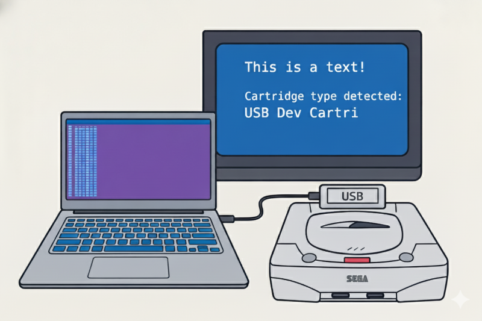
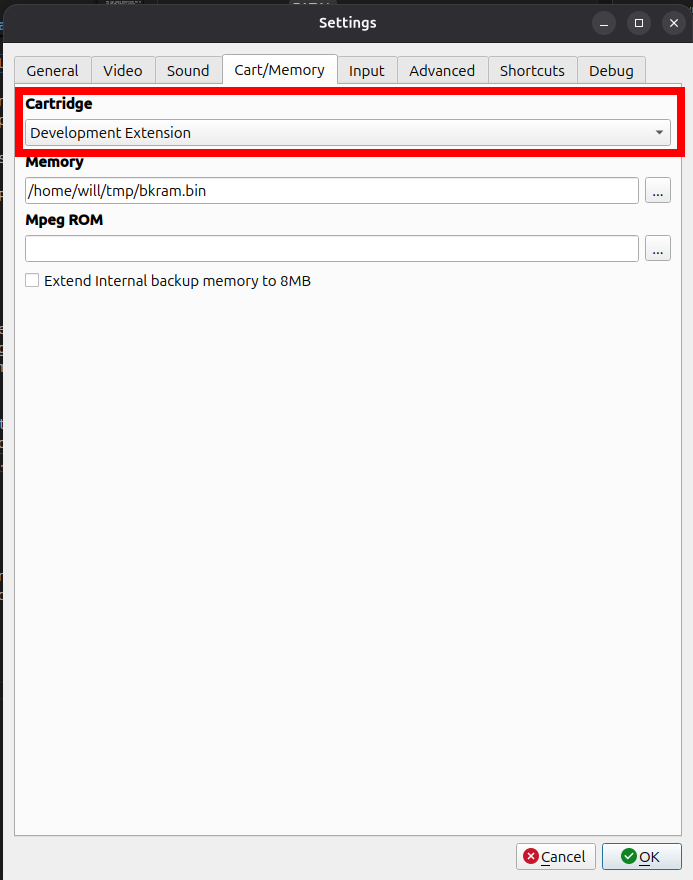
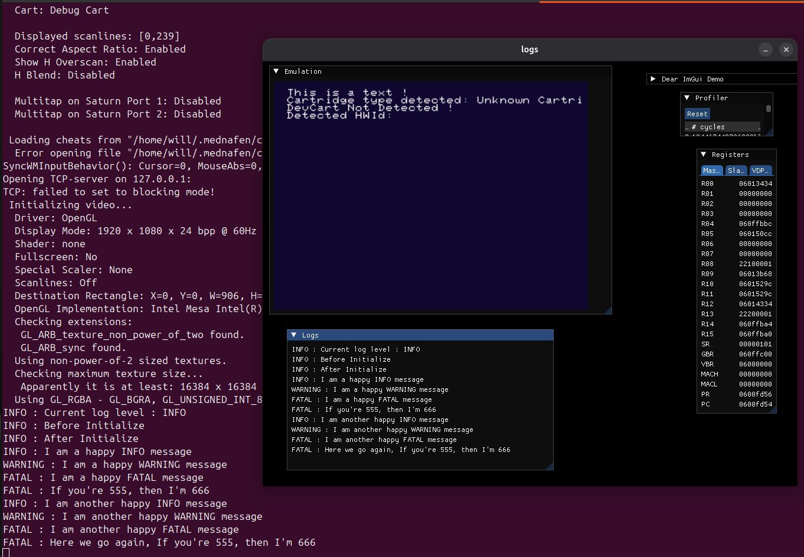

# Overview of Logs Sample

The Logs sample demonstrates how to use the SRL library's logging system, control log levels, and output log messages to different destinations.
Here's a breakdown of how it works:

1. **Logging** System: The sample uses the SRL::Logger namespace to log messages at different levels controlled by the SRL_LOG_LEVEL parameter defined in the makefile.
2. **Log Levels**: The sample tests various log levels, including TRACE, TESTING, INFO, WARNING, and FATAL. The SRL_LOG_LEVEL parameter determines which log levels are compiled into the code. For example, if SRL_LOG_LEVEL is set to INFO, log messages with levels TRACE and TESTING will be compiled out.
3. **Log Output**: The sample uses the SRL_LOG_OUTPUT parameter to determine where log messages are output. The possible values are DEV_CART, EMULATOR, and NONE. If SRL_LOG_OUTPUT is set to DEV_CART, log messages will be sent to the DevCartLogger.
4. **DevCartLogger**: The DevCartLogger is a logger that sends log messages to the DevCart device via USB. The sample checks if a DevCart is connected and logs a message to the DevCartLogger if it is.
5. **Cartridge Detection**: The sample detects the type of cartridge inserted into the Sega Saturn using the SRL::Cartridge::DetectCartridgeType function. It then displays the detected cartridge type on the debug overlay.

To modify the logging behavior, you can adjust the SRL_LOG_LEVEL and SRL_LOG_OUTPUT parameters in the makefile. For example, you can change SRL_LOG_LEVEL to TRACE to enable tracing or set SRL_LOG_OUTPUT to EMULATOR to output log messages to the emulator.

## Parametrization from makefile

The behavior of `main.cxx` can be controlled through various parameters defined in the `makefile`. Two important parameters are `SRL_LOG_LEVEL` and `SRL_LOG_OUTPUT`.

*   `SRL_LOG_LEVEL`: This parameter determines the maximum log level that will be displayed. Possible values are:
    *   `TRACE`
    *   `TESTING`
    *   `INFO`
    *   `WARNING`
    *   `FATAL`

    For example, if `SRL_LOG_LEVEL` is set to `INFO`, log messages with levels `TRACE` and `TESTING` will be compiled out.

*   `SRL_LOG_OUTPUT`: This parameter specifies where log messages will be output. Possible values are:
    *   `DEV_CART`
    *   `EMULATOR`
    *   `NONE`

    For example, if `SRL_LOG_OUTPUT` is set to `DEV_CART`, log messages will be sent to the USB Gamer's Cartridge.

By modifying these parameters in the `makefile`, you can control the logging behavior of `main.cxx` to suit your needs.

## USB Gamer's cartridge

## Kronos / Yabause

## Mednafen

A special version of Mednafen has been modified to handle logs the same way Yabause and kronos are already doing it : https://github.com/willll/mednafenSSDev

